# IntraViewer — Project Report
### AI-Powered Interview Preparation Platform

> **Course/Module:** [Insert Course Name]  
> **Submitted By:** [Student Name(s)]  
> **Student ID(s):** [Insert IDs]  
> **Supervisor:** [Supervisor Name]  
> **Institution:** [University Name]  
> **Date of Submission:** February 2026

---

## Table of Contents

1. [Abstract](#1-abstract)
2. [Introduction](#2-introduction)
3. [Problem Statement](#3-problem-statement)
4. [Objectives](#4-objectives)
5. [System Architecture Overview](#5-system-architecture-overview)
6. [Technology Stack](#6-technology-stack)
7. [UML Diagrams](#7-uml-diagrams)
   - 7.1 [Use-Case Diagram](#71-use-case-diagram)
   - 7.2 [Class Diagram (Backend Data Models)](#72-class-diagram-backend-data-models)
   - 7.3 [Class Diagram (Frontend Component/Service Layer)](#73-class-diagram-frontend-componentservice-layer)
   - 7.4 [Sequence Diagram — User Signup & Login](#74-sequence-diagram--user-signup--login)
   - 7.5 [Sequence Diagram — Interview Session Flow](#75-sequence-diagram--interview-session-flow)
   - 7.6 [Sequence Diagram — AI Question Generation](#76-sequence-diagram--ai-question-generation)
   - 7.7 [Data Flow Diagram — Level 0 (Context)](#77-data-flow-diagram--level-0-context)
   - 7.8 [Data Flow Diagram — Level 1 (Major Processes)](#78-data-flow-diagram--level-1-major-processes)
   - 7.9 [Entity-Relationship (ER) Diagram](#79-entity-relationship-er-diagram)
   - 7.10 [State Machine Diagram — Interview Session States](#710-state-machine-diagram--interview-session-states)
   - 7.11 [Component / Deployment Architecture Diagram](#711-component--deployment-architecture-diagram)
   - 7.12 [Activity Diagram — Full User Journey](#712-activity-diagram--full-user-journey)
8. [Detailed System Modules](#8-detailed-system-modules)
   - 8.1 [Authentication Module](#81-authentication-module)
   - 8.2 [CV & Job Description Intake Module](#82-cv--job-description-intake-module)
   - 8.3 [AI Question Generation Module](#83-ai-question-generation-module)
   - 8.4 [Live Interview Session Module](#84-live-interview-session-module)
   - 8.5 [AI Analysis & Emotion Detection Module](#85-ai-analysis--emotion-detection-module)
   - 8.6 [Results & Transcript Module](#86-results--transcript-module)
9. [Database Design](#9-database-design)
10. [API Design](#10-api-design)
11. [Frontend Architecture](#11-frontend-architecture)
12. [Security Design](#12-security-design)
13. [AI / Machine Learning Components](#13-ai--machine-learning-components)
14. [Testing](#14-testing)
15. [Deployment](#15-deployment)
16. [Challenges & Limitations](#16-challenges--limitations)
17. [Future Work](#17-future-work)
18. [Conclusion](#18-conclusion)
19. [References](#19-references)

---

## 1. Abstract

IntraViewer is a full-stack, AI-powered interview preparation platform built to help job seekers simulate realistic interview experiences from the comfort of their own environment. Users upload their CV and a job description; the system then uses a locally-hosted Large Language Model (LLM — Phi-3 Mini via `llama_cpp`) to generate personalised interview questions with model answers. During the live interview session, a WebSocket connection streams audio chunks in real time to a Faster-Whisper ASR model for transcription. A fine-tuned vision-language model (SmolVLM2-500M) monitors video frames to detect candidate emotions. At the end of a session, stored transcripts and analysis results are available for review.

The backend is built with **FastAPI (Python)** and uses **PostgreSQL** as its relational database, containerised with **Docker**. The frontend is built with **Next.js 14 (TypeScript/React)** and manages application state with **Zustand**.

---

## 2. Introduction

The modern recruitment process is increasingly competitive. Candidates must not only possess the right technical skills but also demonstrate communication competence, composure under pressure, and self-awareness — all of which require dedicated practice. Traditional preparation methods (mock interviews with peers, reading guides) are limited by convenience, feedback quality, and cost.

IntraViewer solves this by bringing AI-powered interview simulation to every candidate. It provides:

- **Personalization** — questions generated from the candidate's own CV and the specific job description they are targeting.
- **Real-time interaction** — media streaming over WebSocket allows immediate audio transcription, simulating a real interview environment.
- **Emotion feedback** — computer vision analysis of video frames during the session.
- **Private & local AI** — all AI models run locally on the server, ensuring data privacy.

---

## 3. Problem Statement

Job seekers face several barriers to effective interview preparation:

| Problem | Impact |
|---|---|
| Generic practice questions unrelated to the candidate's background | Low relevance, wasted time |
| No real-time feedback on communication or body language | Candidates repeat the same mistakes |
| Expensive professional coaching | Inaccessible for most students and early-career professionals |
| Lack of structured self-assessment | Difficulty tracking improvement over time |

IntraViewer addresses all four issues in a single, cohesive platform.

---

## 4. Objectives

1. Develop a **secure user authentication system** with JWT-based access and refresh tokens.
2. Build a **CV and job description ingestion pipeline** that extracts text from PDF/image/text files.
3. Implement an **AI question generation service** using a local LLM to produce contextually relevant interview questions with model answers.
4. Create a **real-time interview session** using WebSocket that live-streams audio for transcription and video for emotion analysis.
5. Persist all session data — questions, transcripts, analysis results — in a **relational database (PostgreSQL)**.
6. Provide a **modern, accessible frontend** (Next.js) with route-based protection, state management, and a polished UI.
7. Package the entire backend for **Docker-based deployment**.

---

## 5. System Architecture Overview

IntraViewer follows a **3-Tier Client-Server Architecture**:

```
┌─────────────────────────────────────────────────────┐
│  PRESENTATION TIER — Next.js 14 (Port 3000)         │
│  React components  |  Zustand state  |  Middleware  │
└────────────────────────┬────────────────────────────┘
                         │  HTTP/REST + WebSocket
┌────────────────────────▼────────────────────────────┐
│  APPLICATION TIER — FastAPI (Port 8000)             │
│  Routers  |  Services  |  AI Services  |  Security  │
└────────────────────────┬────────────────────────────┘
                         │  SQLAlchemy ORM
┌────────────────────────▼────────────────────────────┐
│  DATA TIER — PostgreSQL 15 (Port 5432)              │
│  users | session | questions | transcripts | ...    │
└─────────────────────────────────────────────────────┘
```

**Communication Protocols used:**
- **REST over HTTPS** — for all standard CRUD operations (auth, question management, session control, results retrieval).
- **WebSocket (WSS)** — for the live interview session, transmitting base64-encoded audio and video chunks from the browser to the backend.

---

## 6. Technology Stack

### Backend

| Layer | Technology | Purpose |
|---|---|---|
| Web framework | FastAPI 0.104 (Python) | REST API + WebSocket server |
| ORM | SQLAlchemy 2.0 | Database abstraction |
| Database | PostgreSQL 15 | Persistent relational storage |
| Container orchestration | Docker Compose | Service management |
| Authentication | Python-Jose (JWT) + Argon2 | Secure token auth, password hashing |
| Speech-to-Text | Faster-Whisper (base model, CTranslate2) | Real-time audio transcription |
| LLM (Q&A generation) | llama_cpp — Phi-3 Mini 4k Instruct GGUF Q4_K_M | Local question generation |
| Emotion Detection | HuggingFace Transformers — SmolVLM2-500M | Vision-language emotion model |
| CV parsing | PyMuPDF, pdfplumber, pytesseract | Text extraction from PDF/images |
| Rate limiting | SlowAPI | API protection |

### Frontend

| Layer | Technology | Purpose |
|---|---|---|
| Framework | Next.js 14 (App Router) | SSR-capable React framework |
| Language | TypeScript | Type-safe development |
| State management | Zustand (with persistence) | Global client state |
| Styling | Tailwind CSS | Utility-first CSS |
| HTTP client | Fetch API (custom service layer) | REST communication |
| Real-time | Browser WebSocket API | Live session streaming |
| Media | MediaDevices API (WebRTC-style) | Camera/microphone access |
| Route protection | Next.js Middleware | Server-side auth gating |

---

## 7. UML Diagrams

> **Note:** All diagrams below are written in [Mermaid](https://mermaid.js.org/) syntax. They render natively in GitHub, GitLab, and most modern Markdown viewers. To render locally, use the [Mermaid Live Editor](https://mermaid.live/).

---

### 7.1 Use-Case Diagram

```mermaid
graph TD
    subgraph IntraViewer System
        UC1[Register / Sign Up]
        UC2[Login]
        UC3[Refresh Access Token]
        UC4[Upload CV]
        UC5[Enter Job Description]
        UC6[Start Interview Session]
        UC7[Generate AI Questions]
        UC8[Live Audio Streaming]
        UC9[Live Video Streaming]
        UC10[View Questions During Session]
        UC11[End / Complete Interview]
        UC12[View Transcript]
        UC13[View Analysis & Score]
        UC14[View Previous Sessions]
        UC15[Change Password]
        UC16[Delete Session - Admin Only]
        UC17[Add Question Manually - Admin Only]
    end

    User((Candidate)) --> UC1
    User --> UC2
    User --> UC3
    User --> UC4
    User --> UC5
    User --> UC6
    UC6 --> UC7
    User --> UC8
    User --> UC9
    User --> UC10
    User --> UC11
    User --> UC12
    User --> UC13
    User --> UC14
    User --> UC15

    Admin((Admin User)) --> UC16
    Admin --> UC17
    Admin --> UC2

    System((AI System)) --> UC7
    System --> UC8
    System --> UC9
```

---

### 7.2 Class Diagram (Backend Data Models)

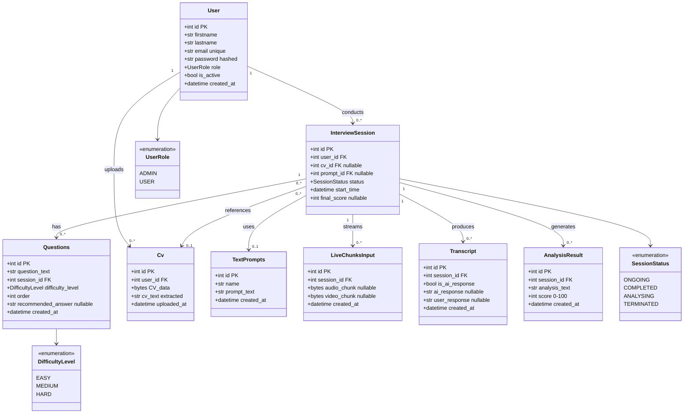

---

### 7.3 Class Diagram (Frontend Component/Service Layer)

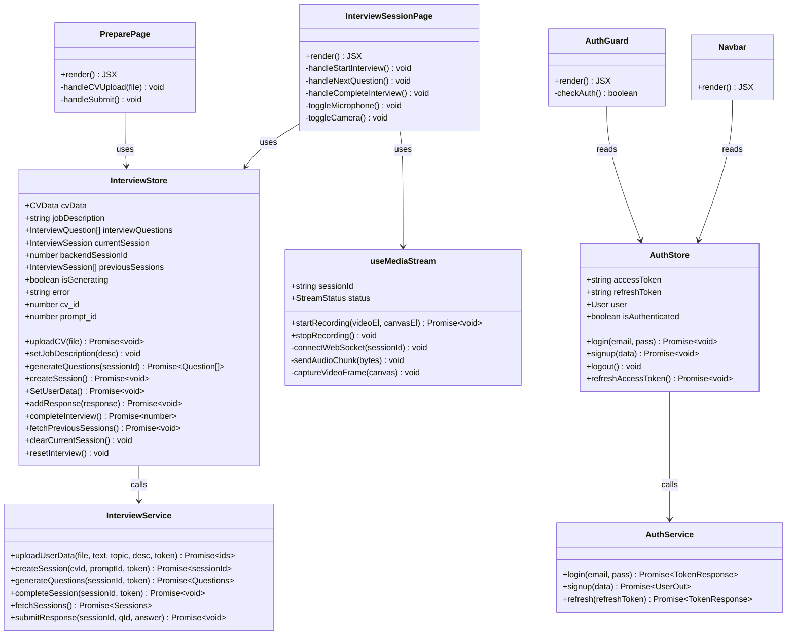

---

### 7.4 Sequence Diagram — User Signup & Login

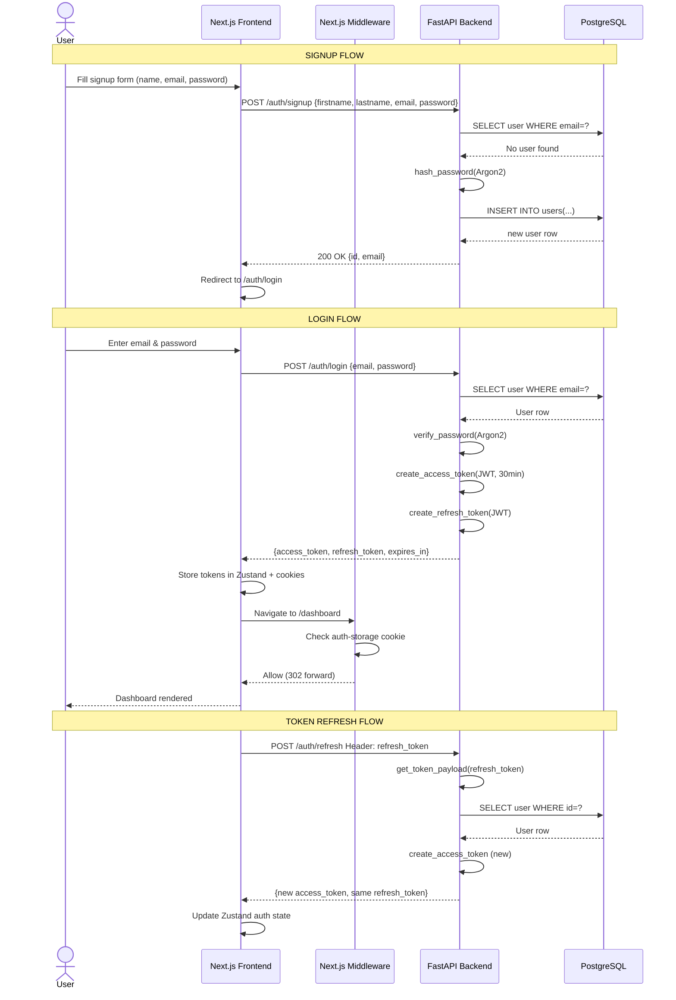

---

### 7.5 Sequence Diagram — Interview Session Flow

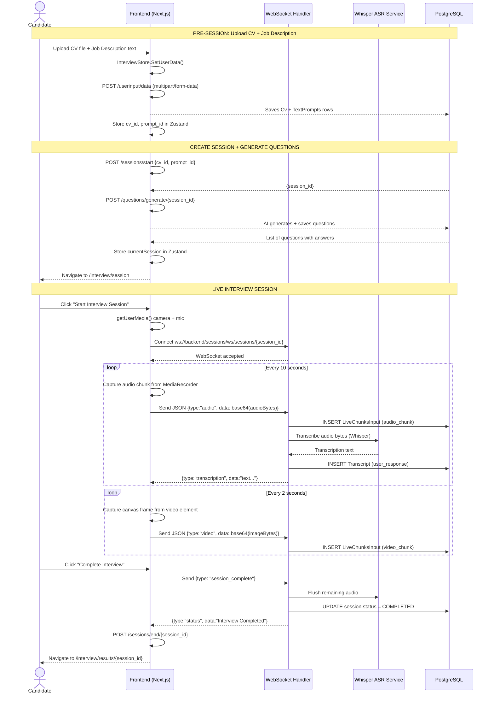

---

### 7.6 Sequence Diagram — AI Question Generation

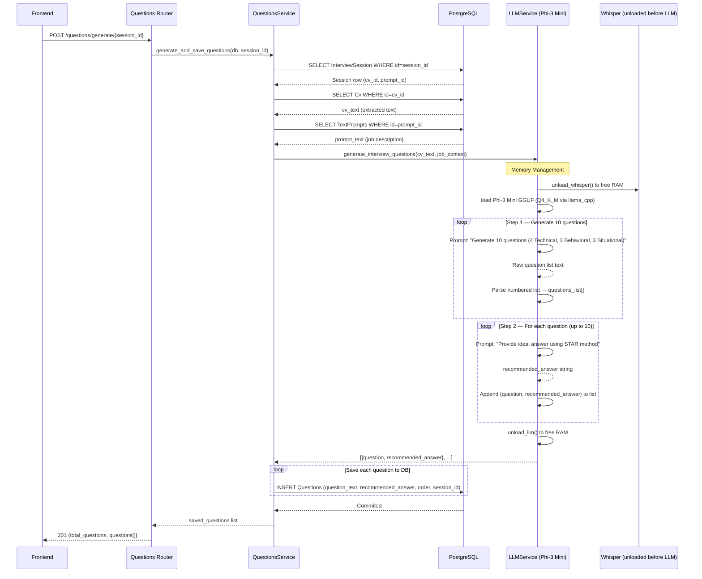

---

### 7.7 Data Flow Diagram — Level 0 (Context)

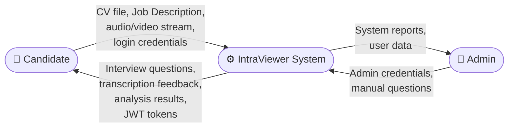

---

### 7.8 Data Flow Diagram — Level 1 (Major Processes)

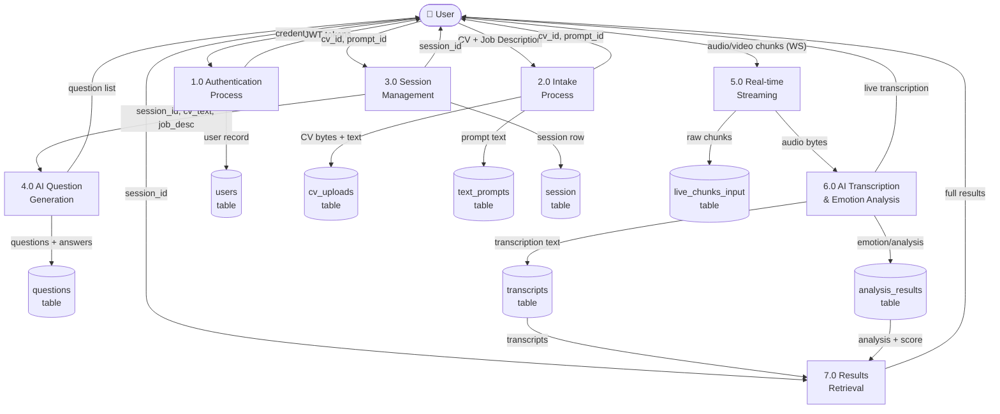

---

### 7.9 Entity-Relationship (ER) Diagram

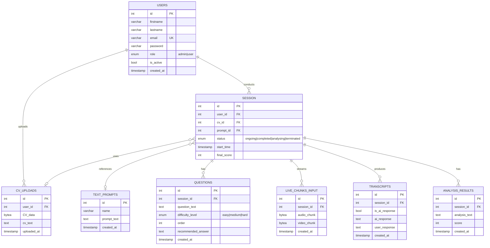

---

### 7.10 State Machine Diagram — Interview Session States

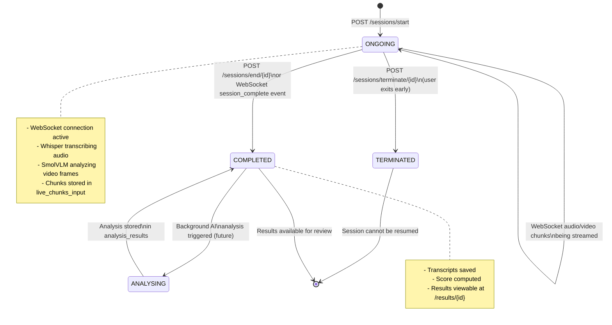

---

### 7.11 Component / Deployment Architecture Diagram

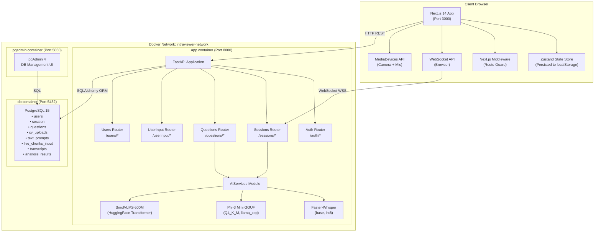

---

### 7.12 Activity Diagram — Full User Journey

```mermaid
flowchart TD
    A([Start]) --> B[Open IntraViewer Landing Page]
    B --> C{Has Account?}

    C -->|No| D[Fill Signup Form]
    D --> E[POST /auth/signup]
    E --> F{Signup Successful?}
    F -->|No| D
    F -->|Yes| G[Navigate to Login]

    C -->|Yes| G
    G --> H[Enter Email & Password]
    H --> I[POST /auth/login]
    I --> J{Auth OK?}
    J -->|No| H
    J -->|Yes| K[Store JWT Tokens in Zustand + cookie]
    K --> L[Dashboard]

    L --> M[Navigate to Interview Prepare]
    M --> N[Upload CV file optional]
    N --> O[Enter Job Description required]
    O --> P[Click: Set My Data]
    P --> Q[POST /userinput/data]
    Q --> R[cv_id + prompt_id returned]
    R --> S[Click: Start Interview]
    S --> T[POST /sessions/start]
    T --> U[session_id returned]
    U --> V[POST /questions/generate/session_id]
    V --> W{LLM Generation OK?}
    W -->|Error| X[Show Error, retry]
    W -->|Success| Y[Navigate to /interview/session]

    Y --> Z[Request camera + mic permission]
    Z --> AA{Permission Granted?}
    AA -->|No| AB[Show Media Error]
    AA -->|Yes| AC[Display video preview]
    AC --> AD[Click: Start Interview Session]
    AD --> AE[Connect WebSocket]
    AE --> AF[Display first question]

    AF --> AG{Answer Question}
    AG --> AH[Audio streamed every 10 sec]
    AH --> AI[Whisper transcribes audio]
    AI --> AJ[Transcription returned to UI]

    AG --> AK[Video frame captured every 2 sec]
    AK --> AL[SmolVLM2 analyzes emotion]
    AL --> AM[Emotion stored in DB]

    AJ --> AN{Next Question?}
    AN -->|More Questions| AF
    AN -->|All Done| AO[Click: Complete Interview]

    AO --> AP[Send session_complete via WebSocket]
    AP --> AQ[POST /sessions/end/session_id]
    AQ --> AR2[Navigate to /results/session_id]
    AR2 --> AS[Display Transcript + Score]
    AS --> AT([End])
```

---

## 8. Detailed System Modules

### 8.1 Authentication Module

**Files:** `backend/src/routers/auth.py`, `backend/src/services/auth.py`, `backend/src/core/security.py`

The authentication module implements a **dual-token (Access + Refresh)** JWT scheme.

| Endpoint | Method | Description |
|---|---|---|
| `/auth/signup` | POST | Register a new user. Passwords hashed with Argon2. |
| `/auth/login` | POST | Validates credentials, returns access + refresh JWT. |
| `/auth/refresh` | POST | Issues a new access token using a valid refresh token. |

**Password hashing:** Argon2 (memory-hard hash function, more secure than bcrypt and not subject to bcrypt's 72-byte password truncation).

**JWT claims:**
- Access token: `{sub: user_id, exp: now + 30min}`, signed with `HS256`.
- Refresh token: `{sub: user_id}`, signed with the same secret (no expiry — stateless).

**Frontend integration:** Zustand `authStore` persists the tokens. A base64-encoded JSON cookie (`auth-storage`) is set by the client so the server-side `middleware.ts` can perform route protection without a server-side session store.

---

### 8.2 CV & Job Description Intake Module

**Files:** `backend/src/routers/userinput.py`, `backend/src/services/inputfunc.py`, `backend/src/utils/file_parser.py`

Accepts a `multipart/form-data` `POST` to `/userinput/data`. The following file formats are supported for CV upload:

- **PDF** — parsed via PyMuPDF and pdfplumber
- **Images (JPG/PNG)** — OCR via Tesseract
- **DOCX** — parsed via python-docx
- **Plain text** — passed through directly

After extraction, the raw bytes and the cleaned text are stored separately in the `cv_uploads` table. The job description text and topic are stored in `text_prompts`.

The endpoint uses **FastAPI BackgroundTasks** to allow the response to be returned immediately while heavy processing could optionally run asynchronously.

---

### 8.3 AI Question Generation Module

**Files:** `backend/src/services/aiservices.py` (`LLMService`), `backend/src/services/questions.py`

**Two-pass generation strategy:**

1. **Pass 1 — Question generation:** The LLM (Phi-3 Mini) receives a structured prompt containing the CV text (truncated to 2000 chars) and job context (truncated to 2500 chars) and outputs a numbered list of 10 questions following a `4 Technical + 3 Behavioral + 3 Situational` distribution.

2. **Pass 2 — Answer generation:** For each of the 10 questions, the LLM receives the question along with the CV context and generates a 3–5 sentence model answer using the **STAR method** (Situation, Task, Action, Result) where applicable.

**Memory management:** The Phi-3 Mini GGUF model (~2.5 GB in Q4_K_M quantization) and Whisper share the same machine memory. The code implements a mutual-exclusion unloading strategy: loading the LLM first calls `unload_whisper()`, and loading Whisper calls `unload_llm()`. After question generation completes, `unload_llm()` is called to reclaim memory for the WebSocket streaming phase.

---

### 8.4 Live Interview Session Module

**Files:** `backend/src/services/sessions.py`, `backend/src/routers/sessions.py`

The WebSocket endpoint `/sessions/ws/sessions/{session_id}` (upgraded from HTTP) handles the live interview:

**Message protocol (client → server):**

| Message Type | Payload | Action |
|---|---|---|
| `"audio"` | `{type:"audio", data: base64(PCM/WAV bytes)}` | Decode, store chunk, transcribe with Whisper, save transcript |
| `"video"` | `{type:"video", data: base64(JPEG bytes)}` | Decode, store chunk (optional Emotion analysis) |
| `"session_complete"` | `{type:"session_complete"}` | Flush remaining audio, mark session COMPLETED |

**Message protocol (server → client):**

| Message Type | Payload | Trigger |
|---|---|---|
| `"transcription"` | `{type:"transcription", data:"text", chunk_number:N}` | After each audio chunk is transcribed |
| `"status"` | `{type:"status", data:"Interview Completed"}` | After session_complete |

**Frontend (useMediaStream hook):** Records audio using `MediaRecorder` API at 10-second intervals. Captures video frames using `Canvas.toBlob()` every 2 seconds. Both are base64-encoded and sent as JSON over the WebSocket.

---

### 8.5 AI Analysis & Emotion Detection Module

**Files:** `backend/src/services/aiservices.py` (classes `EmotionDetector`, `LLMService.evaluate_candidate_response`)

**Emotion Detection:** `EmotionDetector` uses the `manis32/emotion_detection_intraviewer` model (a fine-tuned checkpoint of `HuggingFaceTB/SmolVLM2-500M-Video-Instruct`). It accepts a PIL Image, formats a chat message, runs inference, and returns a JSON object describing the detected primary emotion.

**Response Evaluation (available, not yet triggered in production flow):** `LLMService.evaluate_candidate_response()` uses the LLM to score a candidate's transcript response against the model answer on a 0–100 scale, providing structured feedback with strengths and improvement areas.

---

### 8.6 Results & Transcript Module

| Endpoint | Method | Description |
|---|---|---|
| `GET /sessions/{session_id}/transcript` | GET | Returns all `Transcript` rows for the session |
| `GET /sessions/{session_id}/analysis` | GET | Returns the `AnalysisResult` row with score |
| `GET /sessions/questions/{session_id}` | GET | Returns all questions for a session |

At the frontend level, the `/interview/results/[id]` page reads these endpoints to display the candidate's performance.

---

## 9. Database Design

### Tables Summary

| Table | Primary Key | Foreign Keys | Purpose |
|---|---|---|---|
| `users` | `id` | — | User accounts |
| `session` | `id` | `user_id→users`, `cv_id→cv_uploads`, `prompt_id→text_prompts` | Interview session control |
| `questions` | `id` | `session_id→session` | AI-generated questions per session |
| `cv_uploads` | `id` | `user_id→users` | CV binary data + extracted text |
| `text_prompts` | `id` | — | Job descriptions / prompts |
| `live_chunks_input` | `id` | `session_id→session` | Raw audio/video chunks from stream |
| `transcripts` | `id` | `session_id→session` | Transcribed audio from Whisper |
| `analysis_results` | `id` | `session_id→session` | AI-generated score and feedback |

### Foreign Key Cascade Behaviour

- `Users → Session`: `ON DELETE CASCADE` — deleting a user removes all their sessions.
- `Session → Questions`: `ON DELETE CASCADE` — deleting a session removes all questions.
- `Session → Transcripts`: `ON DELETE CASCADE`
- `Session → LiveChunksInput`: `ON DELETE CASCADE`
- `Session → AnalysisResults`: `ON DELETE CASCADE`
- `Session.cv_id → Cv`: `ON DELETE SET NULL` — CV can be deleted without destroying the session record.
- `Session.prompt_id → TextPrompts`: `ON DELETE SET NULL`

---

## 10. API Design

### Base URL

- Development: `http://localhost:8000`
- WebSocket: `ws://localhost:8000/sessions/ws/sessions/{session_id}`

### Authentication

All non-public endpoints require:
```
Authorization: Bearer <access_token>
```

### Endpoint Reference

| Router | Endpoint | Method | Auth | Description |
|---|---|---|---|---|
| **Auth** | `/auth/signup` | POST | No | Register new user |
| | `/auth/login` | POST | No | Login, get tokens |
| | `/auth/refresh` | POST | No (refresh_token header) | Refresh access token |
| **User Input** | `/userinput/data` | POST | Yes | Upload CV + Job Description |
| **Sessions** | `/sessions/start` | POST | Yes | Create new interview session |
| | `/sessions/end/{id}` | POST | Yes | Mark session completed |
| | `/sessions/terminate/{id}` | POST | Yes | Terminate session early |
| | `/sessions/delete/{id}` | DELETE | Admin | Hard delete session |
| | `/sessions/ws/sessions/{id}` | WS | No* | Live streaming WebSocket |
| | `/sessions/{id}/analysis` | GET | Yes | Fetch analysis/score |
| | `/sessions/{id}/transcript` | GET | Yes | Fetch transcripts |
| | `/sessions/questions/{id}` | GET | Yes | Fetch session questions |
| **Questions** | `/questions/generate/{id}` | POST | Yes | AI generate questions |
| | `/questions/session/{id}` | GET | Yes | Get questions (no answers) |
| | `/questions/session/{id}/with-answers` | GET | Yes | Get questions + answers |
| | `/questions/all` | GET | Yes | All questions (Admin) |
| | `/questions/add` | POST | Admin | Manually add question |
| **Users** | `/users/me` | GET | Yes | Get current user profile |
| | `/users/change-password` | PUT | Yes | Update password |

\* WebSocket auth is enforced by verifying the session belongs to the user prior to accepting the connection.

---

## 11. Frontend Architecture

### Directory Structure

```
frontend/
├── app/                        # Next.js App Router pages
│   ├── page.tsx                # Landing page
│   ├── layout.tsx              # Root layout (Navbar, global CSS)
│   ├── auth/
│   │   ├── login/page.tsx
│   │   └── signup/page.tsx
│   ├── dashboard/page.tsx
│   ├── interview/
│   │   ├── prepare/page.tsx    # CV + Job Description intake
│   │   ├── session/page.tsx    # Live interview (WebSocket)
│   │   └── results/[id]/page.tsx
│   ├── profile/page.tsx
│   └── api/                    # Next.js API routes (proxy)
├── components/
│   ├── Navbar.tsx
│   ├── Drawer.tsx
│   ├── AuthLayout.tsx
│   ├── PreviousSessionsModal.tsx
│   ├── guards/AuthGuard.tsx
│   └── ui/button.tsx
├── lib/
│   ├── stores/
│   │   ├── authStore.ts        # Zustand auth state
│   │   └── interviewStore.ts   # Zustand interview state
│   ├── services/
│   │   ├── authService.ts      # API calls for auth
│   │   └── interviewService.ts # API calls for interview
│   ├── hooks/
│   │   ├── useMediaStream.ts   # WebSocket + media recording
│   │   └── ...
│   ├── types/                  # TypeScript interfaces
│   └── constants/              # App-wide constants
└── middleware.ts               # Route protection middleware
```

### State Management

Zustand was chosen over Redux for its minimal boilerplate. Two stores are used:

- **`authStore`** — manages `accessToken`, `refreshToken`, `user`, `isAuthenticated`. Persisted to `localStorage` via `zustand/middleware/persist` and also set as a base64-encoded cookie for server-side middleware access.
- **`interviewStore`** — manages the full interview lifecycle state. CV objects are NOT persisted (non-serializable), but `cv_id`, `prompt_id`, `backendSessionId`, and `currentSession` are.

---

## 12. Security Design

### Authentication & Authorisation

| Measure | Implementation |
|---|---|
| Password hashing | Argon2 (memory-hard, timing-attack resistant) |
| Access tokens | JWT HS256, 30-minute expiry |
| Refresh tokens | JWT HS256, longer-lived (no explicit expiry in current implementation) |
| Route protection (server-side) | Next.js middleware reads `auth-storage` cookie |
| Route protection (client-side) | `AuthGuard` component, `authStore.isAuthenticated` |
| Admin-only endpoints | Role check in service layer (`user.role != "admin"` → 403) |
| CORS | Restricted to `http://localhost:3000` during development |
| Database | Parameterised queries via SQLAlchemy ORM (prevents SQL injection) |

### Data Privacy

- All AI models run **locally on the server** — CV and audio data are never sent to external APIs.
- Audio/video chunks are stored in the database as binary blobs, not on a public file system.

---

## 13. AI / Machine Learning Components

### Component Overview

| Component | Model | Framework | Task | Memory Strategy |
|---|---|---|---|---|
| Speech-to-Text | `faster-whisper` base | CTranslate2 + PyTorch | Audio transcription | Unloaded when LLM is needed |
| LLM | Phi-3 Mini 4k Instruct (Q4_K_M GGUF, ~2.5 GB) | llama_cpp | Question + answer generation | Unloaded after generation completes |
| Emotion Detection | `manis32/emotion_detection_intraviewer` (SmolVLM2-500M fine-tune) | HuggingFace Transformers + PyTorch | Image emotion classification | Unloaded when LLM/Whisper is needed |

### Memory Management

Because the server may run on hardware without enough RAM to hold all three models simultaneously, a **mutual-exclusion model loading** strategy is implemented:

```python
def load_whisper():
    unload_llm()      # Free LLM before loading Whisper
    unload_emotion()
    whisper_model = WhisperModel("base", device="cpu", compute_type="int8")

def load_llm():
    unload_whisper()  # Free Whisper before loading LLM
    llm_model = Llama.from_pretrained(...)

def load_emotion():
    unload_llm()      # Free LLM before loading Emotion model
    unload_whisper()
    model = AutoModelForImageTextToText.from_pretrained(...)
```

### Phi-3 Mini Prompt Templates

The Phi-3 Mini model uses a structured chat format. Each prompt wraps the system context and user request in special delimiters. For question generation, the system role establishes the interviewer persona, the CV text and job description are embedded in the user turn, and the model is instructed to output a strictly numbered list of exactly 10 questions in the format **1. Question text**. A second prompt pattern is used for recommended answer generation: the model is given a single question plus CV context and asked to respond with a 3-5 sentence STAR-format answer.

---

## 14. Testing

### 14.1 Backend Testing

The backend includes a test suite using **pytest** and **pytest-asyncio** for async route testing.

| Test Category | Scope | Tools |
|---|---|---|
| Unit tests | Service functions (auth, questions) | pytest, pytest-asyncio |
| Integration tests | FastAPI routes via TestClient | FastAPI TestClient |
| Database tests | ORM model CRUD operations | SQLAlchemy in-memory SQLite |

Key test scenarios:
- User signup with duplicate email returns 409
- Login with wrong password returns 401
- Generating questions without CV attached returns 400
- WebSocket connection to a non-existent session is rejected

### 14.2 Frontend Testing

Frontend testing can be performed with:
- **Jest** + **React Testing Library** for component unit tests
- **Playwright** or **Cypress** for end-to-end browser tests

Currently, the frontend has been validated through manual testing across the full user journey (signup → login → CV upload → session → results).

### 14.3 API Testing

All API endpoints have been validated using **Postman** and curl scripts available in the **docs/** directory. The FastAPI auto-generated **Swagger UI** (available at `http://localhost:8000/docs`) provides interactive documentation for every endpoint.

---

## 15. Deployment

### 15.1 Local Development Setup

**Prerequisites:**
- Python 3.10+
- Node.js 18+
- Docker Desktop
- PostgreSQL 15 (if not using Docker)

**Backend (with Docker Compose):**

```bash
cd backend
cp .env.example .env          # Fill in DB credentials, SECRET_KEY, etc.
docker compose up --build     # Starts app (8000), db (5432), pgadmin (5050)
```

**Backend (without Docker):**

```bash
cd backend
python -m venv venv
source venv/bin/activate
pip install -r requirements.txt
uvicorn src.main:app --reload --port 8000
```

**Frontend:**

```bash
cd frontend
npm install
cp .env.example .env.local   # Set NEXT_PUBLIC_API_URL=http://localhost:8000
npm run dev                  # Starts on port 3000
```

### 15.2 Environment Variables

**Backend (.env):**

| Variable | Example | Purpose |
|---|---|---|
| DATABASE_URL | postgresql+psycopg://... | Full SQLAlchemy connection string |
| DB_USERNAME | postgres | PostgreSQL username |
| DB_PASSWORD | secret | PostgreSQL password |
| DB_HOST | localhost | DB host |
| DB_PORT | 5432 | DB port |
| DB_NAME | intraviewer | Database name |
| SECRET_KEY | long-random-string | JWT signing secret |
| ALGORITHM | HS256 | JWT algorithm |
| ACCESS_TOKEN_EXPIRE_MINUTES | 30 | Token lifetime |
| PGADMIN_DEFAULT_EMAIL | admin@admin.com | pgAdmin login |
| PGADMIN_DEFAULT_PASSWORD | admin | pgAdmin password |

**Frontend (.env.local):**

| Variable | Example | Purpose |
|---|---|---|
| NEXT_PUBLIC_API_URL | http://localhost:8000 | Backend base URL |

### 15.3 Docker Compose Architecture

The backend docker-compose.yml defines three services on a shared bridge network (**intraviewer-network**):

1. **app** (Port 8000) — FastAPI server. Waits for **db** health check before starting.
2. **db** (Port 5432) — PostgreSQL 15 Alpine. Named volume for persistence. Health-checked with `pg_isready`.
3. **pgadmin** (Port 5050) — pgAdmin 4 web UI for database inspection.

Database tables are auto-created on startup via SQLAlchemy's `Base.metadata.create_all(engine)` call in `main.py`.

---

## 16. Challenges & Limitations

| Challenge | Impact | Mitigation |
|---|---|---|
| Limited server RAM (AI models cannot co-exist) | Models must be loaded/unloaded serially, adding latency | Mutual-exclusion loading strategy; quantised GGUF model (Q4_K_M ~2.5 GB) |
| WebSocket authentication complexity | Standard HTTP Bearer auth not available during WS handshake | Session ownership validated before WS upgrade by querying DB with session_id |
| Whisper audio format requirements | Browser MediaRecorder produces WebM/Opus; Whisper expects PCM WAV | Audio decoded using the av/PyAV library before transcription |
| LLM output parsing variability | LLM may deviate from strict numbered list format | Regex-based line parser with fallback pattern matching |
| CV text extraction quality | Scanned PDFs or complex layouts may produce garbled OCR | Multiple extraction backends (PyMuPDF, pdfplumber, Tesseract) with fallback |
| Refresh token security | Refresh tokens are stateless (not stored in DB) | No revocation possible without a token blacklist (planned future work) |
| Frontend/Backend state synchronisation | Zustand state can become stale after page refresh | Persistence of cv_id, prompt_id, backendSessionId to localStorage |

---

## 17. Future Work

| Feature | Priority | Description |
|---|---|---|
| Full response evaluation pipeline | High | Wire up existing LLMService.evaluate_candidate_response() to run automatically on session completion |
| Token blacklist for refresh tokens | High | Store refresh tokens in DB to support explicit logout and revocation |
| GPU acceleration | High | Move AI inference from CPU to CUDA/MPS GPU for dramatically faster transcription and LLM inference |
| Async AI processing | Medium | Move AI tasks to Celery + Redis background workers to avoid blocking the WebSocket event loop |
| Production deployment | Medium | Nginx reverse proxy, HTTPS/WSS, environment-specific Docker images, CI/CD pipeline |
| User progress tracking | Medium | Dashboard showing improvement over multiple sessions, skill radar charts |
| Streaming LLM output | Medium | Stream question text token-by-token to the frontend for a more interactive feel |
| Multi-language support | Low | Whisper supports 99 languages; expose language selection in the UI |
| Mobile application | Low | React Native or Flutter wrapper for iOS/Android |
| Admin analytics dashboard | Low | View aggregated session statistics, question popularity, and emotion trends |

---

## 18. Conclusion

IntraViewer demonstrates the practical viability of building a fully self-contained, AI-powered interview preparation platform with no dependency on external AI APIs. By combining:

- A modern **Next.js + TypeScript** frontend with rich UX and real-time WebSocket streaming
- A well-structured **FastAPI** backend following clean separation of concerns (Routers → Services → Models)
- **PostgreSQL** for robust relational data storage
- **Locally hosted AI models** (Whisper, Phi-3 Mini, SmolVLM2) for privacy and cost control

The system achieves its core objective: giving any job seeker a personalised, interactive, and insightful mock interview experience.

The architecture is extensible. The modular service layer makes it straightforward to swap AI models, add new session types, or integrate cloud inference as GPU resources become available. Docker-based deployment ensures the system runs consistently on any machine.

The project contributes a practical reference architecture for full-stack AI application development, illustrating real-world challenges such as multi-model memory management, WebSocket-based streaming pipelines, and secure JWT authentication in a Next.js application.

---

## 19. References

1. **FastAPI** — Ramirez, S. (2018). FastAPI framework. https://fastapi.tiangolo.com/
2. **Next.js** — Vercel. (2016). Next.js Documentation. https://nextjs.org/docs
3. **SQLAlchemy** — Bayer, M. (2006). SQLAlchemy. https://www.sqlalchemy.org/
4. **Faster-Whisper** — SYSTRAN. (2023). CTranslate2-based Whisper implementation. https://github.com/SYSTRAN/faster-whisper
5. **Phi-3 Mini** — Microsoft Research. (2024). Phi-3 Technical Report. https://arxiv.org/abs/2404.14219
6. **SmolVLM2** — HuggingFace. (2024). SmolVLM2-500M-Video-Instruct. https://huggingface.co/HuggingFaceTB/SmolVLM2-500M-Video-Instruct
7. **Zustand** — Poimandres. (2019). https://zustand-demo.pmnd.rs/
8. **Argon2** — Biryukov, A., Dinu, D., & Khovratovich, D. (2015). RFC 9106. https://www.rfc-editor.org/rfc/rfc9106
9. **Docker** — Docker Inc. (2013). https://docs.docker.com/
10. **PostgreSQL** — PostgreSQL Global Development Group. (1996). https://www.postgresql.org/docs/
11. **llama.cpp** — Gerganov, G. (2023). https://github.com/ggerganov/llama.cpp
12. **Pydantic** — Colvin, S. (2020). https://docs.pydantic.dev/

---

*This document was produced as part of a university project submission. All code, architecture decisions, and AI integrations described herein are the original work of the project team.*
